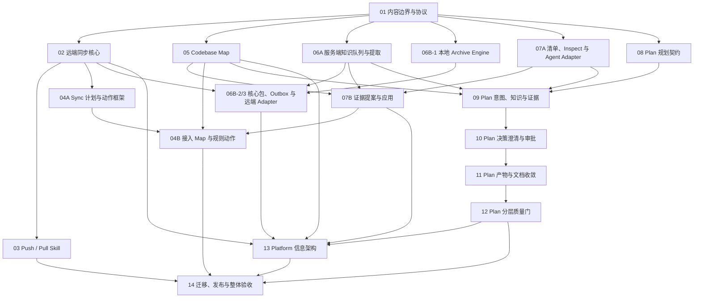

# Hunter Harness 统一优化实施路线

## 文档用途

产品方向讨论见 [高效交付与自动资产沉淀草案](product-optimization-proposal-2026-09.md)。该草案的三项产品决策已于 2026-09-07 敲定（个人与小团队优先；事实+经验自动、规则与可执行资产受控；新任务默认完整任务入口、保留显式阶段调用），批次 0 基线方法与任务集见 [批次 0：任务成本基线与对照方法](batch0-baseline-and-method.md)。草案其余部分仍不替代下面的既有实施合同。

本目录集中记录已确认的优化方案：

- 远端同步、恢复、知识提取、指令治理和项目工作台调整。
- Codebase Map 的增量维护、证据质量和按需消费。
- `harness-plan` 的意图理解、知识查询、设计审批和产物收敛。

同步、知识、Codebase Map、指令治理、Plan、Platform 和迁移方案已按依赖关系统一编排。阶段编号是稳定的文档标识，不代表所有阶段必须线性执行。实施时一个分支或一个负责人只处理一个有独立验收条件的工作包；不同工作包只有在共享契约已经冻结、修改文件不重叠时才能并行。

## 依赖图与推荐实施顺序



图中的 `04A/04B`、`06A/06B-1/06B-2/3` 和 `07A/07B` 是同一阶段内的工作包，不新增公共阶段编号。推荐按以下波次实施：

| 波次 | 可并行工作 | 汇合条件 |
|---:|---|---|
| 0 | 阶段 01；记录阶段 14 定义的 Plan 现状基线 | 内容分类、版本身份、状态和共享 Schema 冻结 |
| 1 | 阶段 02；阶段 05 的本地 Map 核心；阶段 06A；阶段 06B-1；阶段 07A；阶段 08 | 各 Module Interface、错误语义和夹具冻结 |
| 2 | 阶段 03；阶段 04A；阶段 06B-2/3；阶段 07B | 每个模块聚焦测试通过，不修改其他轨道的 canonical 文件 |
| 3 | 阶段 04B；阶段 09；阶段 13 的分支文件、项目资料和知识页面骨架 | 跨模块 Adapter 契约测试通过，OpenAPI 一致 |
| 4 | 阶段 10 → 11 → 12 严格串行；阶段 13 可继续实现不依赖 Plan 事件的页面 | Plan 产物与事件 Schema 冻结，Platform 完成最终接入 |
| 5 | 阶段 14 | 所有工作包关闭，完成迁移、真实流程和候选验证 |

这个顺序基于以下依赖：

1. 内容分类和远端版本协议先稳定，Push、Pull 和 Sync 才有唯一语义。
2. Remote Sync、Codebase Map、服务端知识、本地 Archive Engine 和 `PlanProfile` 的内部实现互不依赖，可以在阶段 01 后并行。
3. Codebase Map 和服务端归档证据的 Interface 先冻结，指令治理才能并行实现证据 Adapter；不要求等待它们的全部 UI 完成。
4. 阶段 09 必须等待 Map、远端知识、canonical 规则读取 Interface 和 PlanProfile 稳定；不需要等待 07B 的提案生成和页面完成。
5. 阶段 10～12 共享同一组 Plan 文件和状态机，必须串行。
6. Platform 可以按页面数据源并行实现，但最终监控和变更展示必须等待 Plan 事件 Schema 冻结。
7. 阶段 14 统一处理兼容、指标、回滚和真实流程验收，不与功能实现并行关闭。

## 并行实施规则

### 先冻结 Interface，再并行 Implementation

每个并行工作包开始前必须提交一份可测试的 Interface，包括：

- 输入、输出、状态枚举和错误码。
- 幂等身份、排序、分页和并发约束。
- 是否写文件、是否访问网络、是否调用模型。
- 兼容读取、功能开关和失败恢复方式。
- 内存 Adapter 或 fixture，供其他工作包在真实实现完成前测试。

Interface 发生破坏性变化时，暂停依赖方并更新契约；不得让多个分支分别猜测同一字段。

### 共享文件采用单一整合通道

以下文件或区域不得由多个并行工作包同时修改：

| 共享区域 | 单一负责人 | 并行工作包的做法 |
|---|---|---|
| 两仓 OpenAPI 与生成类型 | 契约整合工作包 | 先提交接口片段和 fixture，由整合工作包统一更新并校验哈希 |
| CLI 命令注册、Skill 清单和版本号 | CLI 整合工作包 | 功能放在独立模块，最后只做一次注册 |
| Server 根路由装配和数据库迁移序号 | Platform 整合工作包 | 路由、仓储和迁移内容先放独立文件，统一接线和编号 |
| `.harness` canonical 路径与 manifest | 对应内容类型的阶段 | 其他阶段只通过 Interface 读取，不直接改写 |
| Plan 状态机、标准产物和 finalizer | 阶段 08～12 当前工作包 | 这些阶段不并行修改同一协议 |

### 合并顺序

同一能力按以下顺序合并：

1. Schema、Interface、fixture 和兼容读取。
2. Module Implementation 与聚焦测试。
3. CLI、Skill、Archive、Sync 或 Platform Adapter。
4. 页面与交互。
5. 跨模块契约测试和真实流程。

不允许先合并只对新 Schema 有效的调用方，再补兼容读取。

### 工作包关闭条件

每个工作包必须同时满足：

- 修改范围与所属阶段一致，没有顺手修改其他阶段的 canonical 文件。
- Interface 测试、聚焦测试和受影响模块类型检查通过。
- 新旧格式的读取或明确迁移路径已验证。
- 对外状态、中文文案和机器错误码一致。
- 记录仍未接入的 Adapter；不得把“依赖方尚未完成”误报为本模块成功。

## 跨文档契约注册表

以下条目是路线文档之间的唯一契约归属。字段或行为需要调整时，先修改“定义阶段”，再更新消费方和契约 fixture；消费方不得自行扩展同名结构。

| 契约 | 定义阶段 | 主要消费方 | 冻结内容 |
|---|---:|---|---|
| `ContentKind`、`SyncScope`、`KnowledgeCandidate`、`ProjectContentCandidate`、机器字段命名 | 01 | 02～14 | 类型、路径归属、候选生命周期、状态和排除范围 |
| `BranchSnapshot`、`SyncPreview`、`SyncReceipt`、`ArchiveSyncReceipt`、分页读取 Interface | 02 | 03、04、06、13、14 | 版本身份、操作方向、冲突、幂等、原子恢复和错误语义 |
| Push/Pull 用户交互 | 03 | 04、06、14 | 范围选择、确认、取消和中文结果 |
| `SyncContext`、`SyncActionProvider`、`SyncPlan` | 04 | 05、07、14 | 适用性、共享项目证据、动作发现、计划哈希、写入声明、收据、局部复查和统一上传询问 |
| `MapInspectionInput`、`MapHealth`、`MapManifestV2`、`MapEvidenceBundle` | 05 | 04、07、09、13、14 | 项目身份、变化证据、源版本、主题证据、预算和新鲜度 |
| `ClosurePolicy`、`ArchivePlan`、`LocalArchiveReceipt`、`ArchivePackageReceipt`、`ArchiveIngestReceipt`、知识与候选查询 | 06 | 02、03、07、09、13、14 | 本地终态、不可变包、远端耐久性、队列、知识类型和候选游标 |
| `InstructionInspectionInput`、`InstructionHealth`、`RulesManifest`、`InstructionProposal`、Agent 投影收据 | 07 | 04、09、13、14 | canonical、输入指纹、证据、提案、应用和投影冲突 |
| `PlanProfile`、`PlannedPhaseSet` | 08 | 09～12、14 | 唯一分类、实际阶段计划和交互白名单 |
| `IntentContract`、`KnowledgeQueryReceipt`、`PlanningContext` | 09 | 10～12、14 | 意图、查询身份、证据、输入版本和局部失效 |
| 决策节点与设计审批包 | 10 | 11、12、14 | 决策类型、依赖前沿、候选和审批状态 |
| Plan 人类产物与机器派生物 | 11 | 12、13、14 | 字段职责、schema 版本、来源哈希和兼容读取 |
| Plan 质量结果、`ReviewExecutionReceipt` 与事件 Schema | 12 | 13、14 | 机器事件、委派与回退、结束门、风险和失败语义 |
| 页面信息架构与分页交互 | 13 | 14 | 页面归属、查询方式和展示状态 |

## 全路线不变量

任一阶段的设计或 Implementation 都不能破坏以下规则：

1. 可复用知识只由服务端知识提取器生成；设计、计划、规则、架构和变更总结不是知识条目。
2. `KnowledgeCandidate` 只进入知识提取器；`ProjectContentCandidate` 只进入项目内容治理。两者都不是最终知识、canonical 规则、架构或 ADR，也不能互相转换而不记录新提案。
3. 配置不做内容敏感扫描，但仍执行路径白名单、凭据路径排除、越界保护和完整性校验。
4. `.harness/rules/`、Codebase Map 和 Plan 人类产物分别只有一个可编辑真相源；Agent 文件、页面和机器产物都是投影或引用。
5. Push、Pull、Archive 和 Sync 不复制远端同步算法，也不通过嵌套 `npx` 间接复用。
6. Sync 不进入 Change 生命周期监控，不管理知识，也不在未确认时调用模型或写文件。
7. 未配置的可选 Provider 返回不适用，不得把 Map、CodeGraph、Change 或规则能力未启用误报为项目异常。
8. Archive 在本地终态形成后先停止阶段计时，再执行可能缓慢的网络上传；ZIP 已持久化和知识已提取是两个状态。
9. 中文文案只用于展示；恢复、幂等、权限和迁移逻辑只读取机器字段。
10. 远端版本不可变，页面分类视图不复制 Blob；更新“最新”只移动版本指针。
11. 所有列表和搜索在存储层分页、授权并按内容类型过滤，不能先全量读取再由前端裁剪。
12. Codebase Map 的 `ARCHITECTURE.md` 描述已验证的现状事实；规则集的 `architecture.md` 只保存需要 Agent 遵循的架构约束；Change 中的 ADR 保存历史取舍，三者不能相互覆盖。
13. OpenAPI、JSON、YAML、持久化收据和事件统一使用 `snake_case`；语言内部命名由 Adapter 显式投影，不能形成第二套线上 Schema。
14. `LocalArchiveReceipt`、`ArchivePackageReceipt` 和 `ArchiveSyncReceipt` 分别证明本地归档、核心包和远端耐久状态，任何一个都不能代替知识提取状态。

## 工作包描述模板

后续开始实施前，在对应阶段文档或任务中填写：

```markdown
### 工作包：<编号和名称>

- Module / Adapter：
- 负责人：
- 输入 Interface 及版本：
- 输出 Interface 及版本：
- 允许修改的路径：
- 禁止修改的共享区域：
- 是否访问网络 / 调用模型 / 写文件：
- 兼容与回滚方式：
- 聚焦测试：
- 依赖的 fixture：
- 汇合门禁：
```

缺少“允许修改路径、禁止共享区域、输入版本和汇合门禁”的工作包不进入并行实施。

| 顺序 | 文档 | 主要交付物 | 状态 |
|---:|---|---|---|
| 01 | [内容边界与协议](./01-content-boundaries-and-contracts.md) | 同步范围、内容类型、状态和 API 契约 | 已关闭（01-M1、01-M2 验收通过） |
| 02 | [远端同步核心](./02-remote-sync-core-and-branch-snapshots.md) | Core 深模块、分支快照、版本与冲突算法 | 实施中（02-M1/M2、Platform 分支快照读模型 M3～M6 与 PostgreSQL Adapter M7 已关闭；Harness CLI 已有 actor-bound HTTP transport，Platform 生产装配、Pull 工作区与页面仍待接入） |
| 03 | [Push / Pull](./03-push-pull-skills.md) | 手动上传、下拉恢复和兼容入口 | 实施中（03-M1 交互编排 Module 与 03-M2 CLI HTTP 适配器已关闭；Platform Pull 工作区事务、GC/恢复和完整生产复审仍待接入） |
| 04 | [Sync 本地维护](./04-sync-maintenance.md) | 只读检查、选择性优化、局部复查、可选上传 | 实施中（04A、04B-1 Map 与 04B-2 Instruction Provider 已关闭；其余 Provider、现有 Sync 与交互 Adapter 待接入） |
| 05 | [Codebase Map](./05-codebase-map-upgrade.md) | 漂移检测、增量生成、原子发布和按需消费 | 实施中（05-M1 纯 Module 与 M3U-FS filesystem contract/Adapter 已关闭；执行编排与消费者 Adapter 待接入） |
| 06 | [归档与服务端知识](./06-archive-and-knowledge-automation.md) | ZIP 持久化、自动提取、重试和历史补处理 | 实施中（06A-M1、06B-1、06B-2a PackageBuilder、06B-2b Outbox、Stage06A PostgreSQL pipeline Adapter/迁移与 06A-WH bounded Worker Host 已关闭；生产队列调度、路由和历史补处理待接入） |
| 07 | [指令与规则治理](./07-instruction-rule-governance.md) | 深模块、规则集、证据提案、Agent 投影和持续更新 | 实施中（07A 与 07B 纯 Module 已关闭；真实执行、CLI、Skill 与 Sync Adapter 待接入） |
| 08 | [Plan 规划契约](./08-plan-contract-and-profiles.md) | 唯一 `PlanProfile`、阶段计划和交互边界 | 实施中（08-M1 分类与阶段集纯 Module 已关闭；现有 Plan、持久化与事件 Adapter 待接入） |
| 09 | [Plan 意图与证据](./09-plan-intent-knowledge-and-evidence.md) | `IntentContract`、远端知识和 `EvidenceMap` | 实施中（09-M1 PlanningContext、09-M2 Knowledge Query contract/route/CLI，以及 PostgreSQL 知识索引/查询收据持久化与生产 main 接线已关闭；真实 PG integration 仍需数据库环境，PlanningContext/Plan Adapter 与后续页面接入待完成） |
| 10 | [Plan 决策与审批](./10-plan-decision-frontier-and-approval.md) | 决策前沿、批量澄清和精简审批 | 实施中（10-M1 决策前沿与审批纯 Module、10-M2 交互呈现与答案收集适配器已关闭；审批写入、持久化与现有 Plan Adapter 待接入） |
| 11 | [Plan 产物收敛](./11-plan-artifact-model-and-document-pruning.md) | 人类真相源、机器派生物和指导文档收敛 | 实施中（11-M1/11-M2 语义引用契约与 M4A publication plan 已关闭；renderer、真实持久发布与旧 finalizer Adapter 待接入） |
| 12 | [Plan 分层质量门](./12-plan-quality-gates-and-finalization.md) | 结构检查、语义一致性和高风险评审 | 实施中（12-M1/M2 验证 Module、M4T durable publication contract 与 Plan-specific FS contract seam 已关闭；真实 StageVerifier、文件发布、事件持久化与状态机 Adapter 待接入） |
| 13 | [Platform 信息架构](./13-platform-information-architecture.md) | 分支文件、项目资料、项目知识和变更记录 | 实施中（13.1～13.5 查询契约、只读 Server Adapter、13.6a 分支监控 Query Adapter、13.6b Materials PG source/production composition、13.6c 导出内部 contract/stream/CAS/metadata 与 13.7 Web 工作台性能/可访问性已关闭；分支快照生产者、知识/变更持久源、导出 HTTP 生命周期与完整生产 API 接线待实施） |
| 14 | [迁移、发布与整体验收](./14-migration-rollout-and-acceptance.md) | 兼容迁移、效果指标、回滚和真实流程验证 | 待实施 |

## 阶段与工作包切分规则

每个阶段必须满足以下条件才可关闭：

1. 一个工作包只修改一个 Module 或一个 Adapter；跨越两者时拆分提交。
2. 若发现前置 Interface 缺失，先补契约工作包，不在实现分支临时发明字段。
3. 每个工作包有独立聚焦测试和明确失败语义。
4. 兼容入口与迁移策略已验证，不要求用户一次性清空已有状态。
5. 中文界面文案、CLI 提示、OpenAPI 和实际行为保持一致。
6. 记录阶段产物、遗留 Adapter、下一工作包输入和汇合门禁。

## 文档一致性门禁

路线文档进入实施前和每次契约修改后执行轻量检查：

- `docs/harness-improvement-roadmap/**` 必须受 Git 跟踪，不能只存在于本地忽略目录。
- 相对链接、Markdown 代码块、标题层级和必需章节有效。
- 契约注册表中的结构只能由定义阶段扩展；消费方出现未登记字段时检查失败。
- 依赖图、推荐波次、阶段内工作包和各文档“依赖与并行边界”保持一致。
- 机器示例遵守阶段 01 的字段命名，枚举和状态不能只存在于中文说明。
- 迁移矩阵覆盖每个被替换的写入格式；验收测试至少包含一个旧 fixture 和一个当前 fixture。

该检查只验证文档结构和契约引用，不把自然语言风格警告升级为实现门禁。

## 后续补充如何归档

- 同一根因、同一协议、同一验收条件：追加到现有阶段文档。
- 可以独立实现和验证，但依赖已有阶段：新增后续阶段文档。
- 会改变总体边界或实施顺序：先修改本索引，再修改具体阶段。
- 仅属于某个页面的视觉细节：写入对应前端阶段，不扩张 Core 或协议阶段。
- 仅属于指令、规则、Agent 入口或投影：写入阶段 07。
- 仅属于 Plan：写入阶段 08～12；只涉及迁移和发布验证时写入阶段 14。
- 阶段性问题报告全部修复后：移入 `archive/`（归档标准与清单见
  [archive/README.md](./archive/README.md)）。

## 当前边界

本目录只记录实施设计，没有修改运行逻辑。后续以依赖图、各文档的“依赖与并行边界”和验收条件确定实施顺序；阶段编号仅用于稳定引用。
