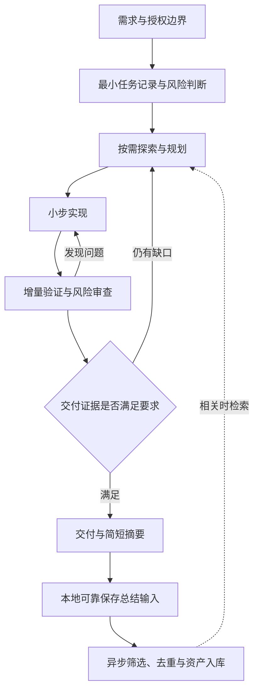

# Hunter Harness 产品重构建议：高效交付与自动资产沉淀

> 日期：2026-09-07
>
> 状态：产品方案草案，供讨论；不构成整仓重构、功能删除或生产发布授权。
>
> 代码观察基线：`ca8fbdf`。现状依据见附录。
>
> 范围：Hunter Harness 的完整使用体验；涉及 Hunter Platform 的部分属于边界建议，本轮未重新审查平台实现。
>
> 本文不替代本目录已有实施合同。采纳具体建议后，再明确替代哪些约定并拆分实施。

## 1. 结论与产品目标

建议将 Hunter Harness 定位为：**帮助 Agent 用与任务风险相称的成本，交付可验证的代码，并自动积累可复用资产的开发辅助系统。**

这条路线有机会同时降低使用负担、模型开销和内部耦合，但前提是减少不必要的职责与状态，不能只在旧流程外增加一个统一入口。轻量也不能通过跳过有效测试、隐藏失败或降低验收标准实现。

产品应提供四项承诺：

1. 简单任务可以直接完成；复杂任务得到足够的规划、编排与验证。
2. Agent 主要处理需求、代码和证据，系统负责身份、重试、收据与恢复。
3. 完成情况有可核验依据；用户不必理解内部阶段就能判断能否交付。
4. 每次任务自动形成简短摘要，有长期价值的经验继续沉淀，资产处理故障不拖住已完成的代码工作。

效率、代码质量和资产价值分别评价，不合成一个可以互相抵消的总分。质量出现严重回退时，节省多少时间都不能视为成功。

### 1.1 本轮已明确的用户目标

- 高效生产高质量代码，减少耗费在 Harness 流程上的时间。
- 强化任务编排、验证、总结和资产积累。
- 可以重新考虑整体流程、每个环节及功能增减，不受当前架构限制。
- 先交付方案文档，再决定实施范围。

### 1.2 待反馈的工作假设

以下是建议默认值，尚不是用户已批准的产品决策：

- 优先服务个人和小团队在多个项目、多种 Agent 中的日常开发；大型组织治理作为可选能力。
- 自动保存有证据的事实与经验；修改长期规则、安装可执行 Skill、扩大权限和对外发布单独受控。
- 默认使用宿主 Agent 的能力；项目不自行成为另一套完整的聊天、模型计费和多 Agent 平台。
- 本地开发闭环可以独立完成；远端服务承担共享、检索、治理和异步加工。

## 2. 现状判断：保留已有成果，重新检查最低成本

| 已核验的现状 | 对下一轮的含义 |
|---|---|
| `fast` 档默认包含 plan、execute、archive，并要求 unitTest | 已有分级，但最低流程成本仍可下降；纯文档修改应匹配文档验证 |
| `configure_phase_plan` 要求从 plan 开始、以 archive 结束 | 无正式阶段的轻任务涉及合同调整，不能仅删除 Skill 中的步骤 |
| `plan publish` 已自动处理部分基线和 attempt | 应延续运行时代管记账的方向，避免重复实现同一能力 |
| 门禁包含计划交接、场景覆盖、ledger、评审绑定及漂移检查 | 这些机制中有质量资产，也有生命周期协调成本；需要逐项区分 |
| 已有效率统计，包括执行次数、等待、失败分类和无新证据的重复命令 | 优先扩展现有采集能力，不新建一套平行监控系统 |
| 技能采用渐进加载，前轮已清理死代码与事件同步侧路 | 不把目录总行数当作实际 token 消耗，不重新提出已完成的删除项 |
| 当前知识候选可从设计、任务、场景、评审和决策中生成 | 应继续检验候选的复用价值，不能用提取数量替代有效性 |

历史调研曾发现 Plan 和代码执行占主要耗时，但属于旧版本样本。它只提示应覆盖完整任务链，不能证明当前各项耗时占比。本轮没有新的任务成本基线，也没有验证以下建议的实际收益。

## 3. 目标体验：一个任务入口，按需展开工作

用户提出需求后，系统先建立最小任务记录：目标、验收条件、范围、风险和授权边界。简单任务不要求独立设计文件；需要取舍、协作或长期恢复时才展开计划。

图表达逻辑关系，不要求每个节点都成为命令、文件、服务或必须停顿的阶段。

### 3.1 三种工作强度，共用同一个实现

| 强度 | 典型任务 | 最低必要行为 | 按需增加 |
|---|---|---|---|
| 轻任务 | 说明修改、明确的局部低风险修复 | 目标、修改、适用验证、最终 diff 检查、简短摘要 | 行为修改的回归测试 |
| 常规任务 | 普通功能、跨文件修复 | 简要计划、小步实现、受影响测试、相关审查、交付摘要 | 依赖图、接口或 UI 验证 |
| 高保障任务 | 权限、迁移、共享状态、破坏性协议 | 明确不变量与失败路径、独立审查、集成验证、恢复或回滚演练 | 对抗测试、兼容矩阵、外部发布门禁 |

这三种强度是策略预设，不建立三套运行时。任务执行中依据实际 diff 重新检查风险，不能只相信最初描述。文档路径中的脚本、工作流配置、依赖和代码生成输入也可能有行为风险。证据不足时升级验证范围；不得为了关闭任务自动降级。

### 3.2 连续执行与用户控制

完整任务入口在已授权范围内持续执行，不在每个技术阶段例行询问。用户显式只调用规划或评审时，仍只完成所要求的环节。

需要打断的情形限于会改变结果的需求歧义、超出授权的外部动作、不可安全推断的破坏性决策，以及无法自行解决的阻塞。集中提出关键问题，并继续无依赖的工作。普通实现细节、可逆修复、重复的权限确认不构成停顿点。

用户始终能查看：已经完成什么、还缺什么、阻塞原因、下一步、当前成本和资产状态。内部 generation、run-id、lease、receipt 默认进入诊断详情。

## 4. 各环节的优化建议

### 4.1 初始化与项目发现

- 最小安装只提供入口、必要适配和项目配置，不预建任务目录和空产物。
- 首次探测构建入口、测试入口、仓库约定、工作区状态和宿主能力；后续按相关文件指纹刷新。
- 初始化健康检查快速返回；完整环境诊断按需执行。普通 status 不隐式运行测试、下载资源或扫描整个历史。
- 项目规则、用户现有文件和安装内容有明确所有权；refresh 保留本地修改并给出可定位差异。
- 区分安装依赖与执行特定功能的依赖。缺少可选能力时明确降级范围，不在启动时阻断无关工作。

### 4.2 需求理解

- 开始时抓取「要改变的行为、可观察的验收结果、不能破坏的约束」。简单任务可以从请求直接得到。
- 只追问会导致不同实现结果的问题；合理假设可记录并继续。
- 将验收条件与实现建议分开，避免把用户提出的一种技术办法误当作唯一目标。
- 新需求改变任务范围时更新必要记录与验证要求，不重新生成整套文档。

### 4.3 代码探索与上下文

- 按问题取证：先定位入口、关键调用链和相关测试，再扩展；索引可用时先利用索引。
- 为探索设置可调整预算，以是否获得新信息判断继续价值，不机械限制为固定文件数。
- 维护紧凑恢复摘要：当前目标、已确认结论、修改位置、待办和证据引用；完整日志按需读取。
- 缓存绑定源文件或仓库版本，失效原因可解释。没有命中与检索失败分开显示。
- 只有涉及历史取舍、兼容或重复问题时查询知识；不以加载更多知识作为质量目标。

### 4.4 规划与任务编排

- 任务拆成可独立验证的小成果，尽早完成一条从入口到结果的可运行路径，减少全部设计完才验证的风险。
- 仅在存在依赖或并行收益时建立任务图。顺序任务用列表即可。
- 每个工作项只需目标、依赖、修改边界和验收条件。状态与证据由运行时维护。
- 优先调度影响最终交付时间的工作；依赖未满足的任务不启动，重复任务合并。
- 新发现只影响相关工作项。保留已验证成果，不因计划文字修改重开整项任务。
- 子 Agent 仅用于有独立产出且收益大于协调成本的探索、实现或评审；不是每个阶段配置固定角色。
- 并行写入需要不冲突的文件范围或隔离工作区。共享接口先约定，合并后验证实际组合，不能把分支各自通过当作整体通过。
- 最大并发服从主机资源和任务预算。启动子 Agent 不得递归失控；主 Agent 负责整合和最终判断。

### 4.5 实现与代码质量

- 每个改动簇执行「实现或复现—验证—检查 diff」，缩短错误存活时间。
- 行为缺陷优先建立可复现的回归证据；纯文档不强制编写模拟测试。
- 质量评价覆盖正确性、异常路径、兼容性、可理解性、变更范围和资源行为，不以覆盖率或行数单独判定。
- 先复用项目已有工具和组件；没有真实复用需求时不新增接口、工厂或通用框架。
- 局部改动不夹带大范围格式化、升级和重构。必要重构单独说明它消除了什么问题。
- 对需求本身有缺陷的情况允许反驳并提供替代方案，不能只追求执行完任务清单。

### 4.6 验证：先快速反馈，再确认交付

验证分三层：修改时运行快速检查；工作项完成时运行受影响测试；交付前运行适用的整体验收与仓库强制检查。已经覆盖同一对象的有效执行不重复记账或重跑。

证据复用至少考虑代码与相关输入、命令及参数、工具链与依赖、必要环境和外部状态。HEAD 相同不足以证明工作区相同；代码相同也不保证外部服务状态相同。

受影响测试选择需要可解释的依赖依据。索引缺失、依赖不完整、共享配置变化或高风险路径变化时扩大验证；实施初期同时对照完整测试，观察漏选情况。不得用更快的测试选择掩盖遗漏。

保留进程树清理、超时、资源预算和可恢复执行，但使用一个权威执行入口，减少重复的 launcher、心跳和状态包装。宿主执行或 CI 证据可以导入，导入必须校验来源、代码版本和完整性，不能接受模型口述「已通过」。

环境失败、测试失败和证据不足分别处理。重试必须有原因与上限；重复同样失败且无新信息时转入诊断。修复评估器或测试基础设施应单独记录，不能在优化实验中放松评估标准。

### 4.7 评审与返工

- 轻任务做最终 diff 自查；常规任务按风险安排独立检查；高保障任务要求独立审查。
- 评审以当前 diff、验收条件和证据为输入，减少重新调查整个仓库。
- 发现应附影响、位置和验证办法。按严重度阻断，建议性意见不无限扩大范围。
- 对评审意见先核实再修复，不能把另一个模型的意见直接当事实。
- 返工只失效受影响的测试和评审结论。改变公共接口、共享配置或整体设计时相应扩大范围。
- 设置评审循环预算；超限时报告未解决问题和可选行动，不为结束循环降低质量要求。

### 4.8 提交、合并与发布

- 在开发过程中尽早明确交付目标：工作区修改、提交、合并或发布，完成状态与这个目标对应。
- 沿用项目协作规则：个人仓库低风险改动可直接主分支；需要隔离时使用分支或工作树；不把 PR 变成所有任务的必经步骤。
- 交付证据绑定实际候选代码。合并改变了候选内容时，重做适用检查。
- 外部写入前重新检查目标与授权；对不确定结果先查询远端回执，避免盲目重试。
- 发布失败不抹掉已经通过验证的实现成果，也不能显示为发布成功。

### 4.9 总结、文档与资产

每个任务同步生成简短交付摘要：完成内容、验证结果、残余风险、下一步和代码位置。能由 Git、测试收据与操作结果得到的事实自动采集；模型补充动机、取舍和解释。

总结输入在本地可靠保存后即可完成交付。远端上传、提取和索引异步执行。队列持久化失败必须显示「总结待保存」并给出恢复方法，不谎称资产已生成；不回滚已验证代码。

按读者生成文档：用户看结果与风险，维护者看取舍与边界，系统读取结构化证据。渲染文档可以重建，不作为第二份可写的状态来源。大型设计文档只在任务确实需要时生成。

## 5. 自动资产：从保存过程到复用经验

### 5.1 资产分类与默认处理

| 类型 | 示例 | 默认处理建议 |
|---|---|---|
| 任务记录 | 改了什么、哪些验证通过 | 每次自动保存，允许按保留策略压缩 |
| 项目事实 | 已验证的接口约束、兼容边界 | 有来源且无冲突时自动保存，检索时检查适用版本 |
| 决策经验 | 为什么采用方案 A、放弃 B | 保存理由、条件和反例；不自动升级为全局规范 |
| 故障案例 | 症状、根因、有效修复和复现办法 | 验证后入库，推测保留候选身份 |
| 可执行资产 | 回归测试、诊断脚本、Skill | 进入代码审查或受控安装流程，不从文本直接执行 |
| 行为规则 | 项目指令、长期开发规则 | 默认生成提案；自动生效需要单独授权和验证 |

优先保留能通过测试或工具表达的成果。已经有稳定回归测试的故障，不必再复制多份长文；知识条目可以解释原因并指向测试。

### 5.2 最小质量闭环

提取候选后，检查来源、适用范围、是否重复或冲突，再决定保存、合并、待确认或丢弃。没有值得沉淀的新知识是正常结果，禁止凑数量。

一条可用资产至少回答：内容是什么、有什么依据、在哪个项目或版本适用、何时可能失效。禁止把一次推测写成用户偏好，或把第三方内容中的指令当作系统规则。

旧知识有版本、替代关系和失效标记。冲突事实不自动覆盖；先保存为候选并给出冲突来源。敏感原文不进入共享索引，项目范围默认隔离。资产导出与上传遵守已有内容边界。

### 5.3 检索与消费

- 返回少量相关证据与出处，控制上下文预算；按项目、版本和问题类型过滤。
- 代码事实以当前仓库为准；历史条目主要解释设计原因和适用边界。
- 区分「被检索」「被实际采用」「被证明有效」，不把点击或命中当收益。
- 记录不适用和错误条目反馈；有证据过时则降低优先级或标记失效，不直接删除历史依据。
- 不因为任务结束自动重写 AGENTS.md。规则增长需要证明重复收益，并替换过时内容。

### 5.4 异步可靠性

复用或改造现有 outbox 与上传回执，避免新建平行队列。持久任务有稳定身份、退避重试、失败详情和容量上限。重复提交不产生重复资产。

交付状态与资产状态分别展示，例如「代码已交付；摘要已保存；知识入库等待网络」。离线时只保留本地摘要与待处理输入，不顺带重建一个本地向量检索平台。需要保留的审计记录遵守项目策略，不能为释放空间静默删除。

## 6. 内部职责与解耦方向

建议采用少量清晰的逻辑边界；初期可以在同一进程、同一仓库实现，不据此增加 npm 包或微服务。

| 职责 | 拥有的事实 | 不应承担的职责 |
|---|---|---|
| 任务协调 | 目标、工作项、依赖、授权范围、当前任务状态 | 解析测试长日志、管理知识索引 |
| 执行与证据 | 操作身份、执行结果、输入绑定、证据有效性 | 决定用户业务目标、解释模型意图 |
| 质量策略 | 风险所需证据、交付条件、阻塞原因 | 写 Git、启动进程、写知识库 |
| 总结与资产 | 交付摘要、候选、入库回执 | 改写代码执行状态、阻断无关本地工作 |
| 宿主与外部适配 | 工具调用、文件投影、Git/CI/远端协议 | 复制一套任务状态机或质量规则 |

质量策略尽量是可测试的纯判断：输入任务、实际变更和证据，输出满足项、缺口及原因。执行由协调层发起；资产层单向消费已确认结果，不反向决定代码阶段是否结束。

### 6.1 状态与持久化

对同一个任务设单一写入权威，保存必要快照和有副作用操作的恢复日志。任务状态可用待执行、执行中、阻塞、完成、取消表达；具体操作仍有必要的内部恢复状态。减少公开状态数量不能删除内部正确性。

不默认采用全量事件溯源、通用工作流 DSL 或数据库迁移。先列出现有每份状态的写入方、读取方和恢复用途，再合并重复职责。仅审计用途的事件不应成为恢复核心状态的唯一依据。

外部副作用通常无法保证端到端恰好一次。使用幂等键、目标状态检查和回执对账；遇到结果未知必须保留未知，不能自动当作失败后重做。

### 6.2 运行时语言与接口

近期统一公开入口和契约，暂不以「全部 TypeScript 化」或「全部 Python 化」为目标。只有跨语言维护与启动成本得到测量，才迁移对应路径。迁移后删除重复实现，避免长期双写。

内部组合直接调用返回结构化结果的业务函数，CLI 负责参数与序列化，避免业务层依赖捕获另一个命令的 stdout JSON。进程或语言边界才使用版本化协议。

接口只为真实变化点建立：进程执行、文件与状态、Git、模型宿主、远端资产。禁止给每个函数都增加一层 provider 或 factory。

### 6.3 宿主适配与产品边界

复用宿主提供的模型会话、工具执行和子 Agent 能力。适配器声明实际支持的能力；缺少后台执行时，资产队列在下次启动或显式维护时恢复，不承诺不存在的持续执行。

CLI 作为稳定通用入口，原生工具或 MCP 按真实需要接入；不能要求用户同时安装全部入口。不同宿主共享任务与证据协议，不各自复制策略和恢复逻辑。

必须区分提示协议和技术强制。仅靠 Skill 文字不能保证模型一定执行测试、禁止绕过工具或正确报告结果。可强制的边界放在工具执行、文件应用、CI 与发布入口；无法拦截宿主操作时，只能提供检查与证据状态，不宣称具备完整强制治理。支持矩阵应公开这些差异。

## 7. 功能增减清单

| 处理 | 功能 | 条件或理由 |
|---|---|---|
| 强化 | 与任务风险相称的验证、证据绑定、用户修改保护 | 直接支撑交付可信度 |
| 强化 | 中断恢复、幂等操作、资源管理 | 降低真实开发失败成本 |
| 新增或收敛 | 完整任务入口与紧凑状态视图 | 用户无需记住阶段命令 |
| 新增或收敛 | 轻任务路径 | 不要求正式 Plan 发布与 Archive 阶段 |
| 强化 | 按实际 diff 更新风险、证据局部失效 | 既省重跑，也防止错误复用 |
| 强化 | 本地摘要、异步资产处理、资产有效性反馈 | 完成自动总结闭环 |
| 合并 | 重复的生命周期记账与执行包装 | 先列出所有权，再逐条迁移 |
| 按需启用 | 详细设计、完整场景表、API 文档、独立评审 | 由任务风险与实际消费者决定 |
| 可选 | 远端治理、共享知识、技能分发、项目文件同步 | 可独立使用和停用，不牵连核心任务 |
| 逐步退役 | 已被统一入口替代的模型操作步骤与重复产物 | 先兼容历史任务，停止新任务写入，再删除 |
| 暂不增加 | 自建聊天平台、通用多 Agent 调度平台、全量遥测后台 | 容易扩大产品范围并重复宿主能力 |
| 暂不增加 | 全自动修改长期规则、无界自我优化 | 先验证资产质量与权限边界 |

退役前必须检查真实消费者、历史兼容和恢复场景。「代码长」或「界面少人看」不能单独构成删除依据。前轮已经移除的 events-sync 侧路不属于本轮新增待办。

## 8. 防止优化后再次变重

每项新能力进入核心前回答四个问题：它解决哪个高频或高损失问题；是否能使用已有能力；增加多少正常路径成本；如何关闭和移除。

- 不为所有任务统一增加字段、审批和文件；低风险正常路径只承担必要成本。
- 一项事实只由一个地方负责写入。导出与渲染可多份，权威状态不可多份。
- 新报告优先从现有证据派生，不再要求模型手工维护同一事实。
- 每项门禁保留具体风险、命中案例和误阻断反馈；只有格式一致性价值的规则优先在内部修复。
- 缓存、队列、日志、快照都有边界和清理策略；只清理已确认可再生或超过保留期的内容。
- 不以并发数量、子 Agent 数量、生成文档数量、知识条目数量证明产品成熟。

## 9. 如何证明更好

### 9.1 对照方法

建立来自真实仓库的任务集，覆盖文档修改、局部缺陷、普通功能、跨模块变更、迁移或权限变更，以及中断恢复。比较原生 Agent、当前 Harness 和候选方案。

三组固定起始代码、需求、模型配置、依赖环境和验收要求；每次使用独立工作区，避免上一轮答案与知识泄漏。冷缓存与热缓存分开统计。先用小样本排除明显退步，再扩大真实项目试用；少量样本不能证明普遍质量等价。

独立验收保留未提供给实现者的行为测试与风险场景，并做盲审。正确性、兼容与用户文件保护是硬约束。不能用「当前测试都过了」单独证明生成代码质量没有下降。

### 9.2 观察指标

| 维度 | 指标与口径 |
|---|---|
| 结果 | 验收通过、严重缺陷、遗漏需求、后续返工；失败任务也计入 |
| 时间 | 端到端墙钟时间、模型工作、工具执行、流程维护与人工等待；并行时间不重复相加 |
| 成本 | 实际可采集的 token 与模型费用；不可采集标为未知，不用文件行数代替 |
| 摩擦 | 人工介入、重复澄清、流程参数错误、状态修复次数 |
| 编排 | 等待依赖的时间、重复探索、合并冲突、并行带来的真实节省 |
| 验证 | 无新证据的重跑、测试漏选、错误证据复用、环境误判 |
| 资产 | 摘要准确性、无依据条目、重复冲突、后续实际采用与有效性 |
| 维护 | 同一能力的权威写入点、协议变更涉及模块数、重复实现与恢复故障 |

流程维护时间指身份、格式、阶段交接和状态修复等协调开销。需求理解、有效测试和真实代码评审即使耗时，也不能一律归入可删除浪费。

### 9.3 建议试点门槛

以下数值是待基线校准的候选目标，不是现有成绩或性能承诺：

- 低风险样本端到端中位时间降低至少 20%，流程维护时间降低至少 50%。
- 测试集内不得出现新的严重验收失败、用户修改丢失或重复外部副作用；一般质量采用预先定义的非劣评估，报告样本量与不确定性。
- 正常路径不要求模型手工填写 attempt、generation 或恢复身份；无需求歧义的低风险任务不因阶段切换打断用户。
- 中断恢复、离线交付、重复收尾和队列失败场景均能保留真实状态，不误报完成。
- 抽查资产的每项事实均有可访问依据；对高价值且适用的条目做后续任务验证，不能只测入库成功。

质量检查先于收益计算。达不到目标时应调整或撤回候选方案，不能减少验收内容换取达标。

## 10. 分批落地与迁移

| 批次 | 交付物 | 完成证据 | 不做什么 |
|---|---|---|---|
| 0：建立基线 | 代表任务集、成本归因、现有状态与消费者清单 | 能重复比较，并定位主要成本 | 不先实现通用框架 |
| 1：轻任务闭环 | 同一运行时中的轻任务入口、适用验证、自动摘要 | 真实任务成本下降，风险升级有效 | 不整体替换高风险流程 |
| 2：减少模型记账 | 统一任务操作、自动身份、可读恢复、证据直接采集 | 正常与故障路径均无需手工修元数据 | 不保留两套可写权威状态 |
| 3：证据驱动交付 | 风险要求、局部失效、任务依赖与增量评审 | 无错误证据复用、并行组合验收通过 | 不提前删除现有有效门禁 |
| 4：资产闭环 | 可靠摘要输入、异步处理、去重失效与反馈 | 网络失败不阻塞交付，资产有来源且可复用 | 不自动放大行为权限 |
| 5：收敛与退役 | 移除被替代命令、重复状态和无消费者产物 | 兼容与恢复样本通过，维护成本降低 | 不长期维持实验模式叠加 |

每批都是端到端可使用的成果，先在少量项目启用，通过后逐步扩大。批次 0～1 的学习结果可能改变后续设计，因此不先冻结全部实现细节。

### 10.1 历史任务与回滚

- 新任务显式记录协议版本，旧任务继续用原解释器完成；不在执行中途静默切换语义。
- 历史归档保持只读，转换需要明确版本与校验；已有消费方未迁移前不停止旧格式支持。
- 新旧实现可在只读评估模式下比较判断结果，但不能同时执行写入、发布或资产投递。
- 回滚首先关闭新任务入口；已开始的新协议任务由对应版本恢复或显式迁移，不能简单切回旧程序读取未知状态。
- 退役条件包括真实消费者为零、兼容窗口结束和恢复验证通过，不能仅凭测试目录没有引用。

### 10.2 故障演练清单

至少覆盖：执行中被打断、重复完成请求、证据对应旧代码、工作区混入他人修改、风险中途升级、测试进程失联、远端结果未知、磁盘写入失败、资产队列重复消费、知识互相冲突，以及宿主缺少后台或子 Agent 能力。

这些测试验证用户结果与副作用边界；文档契约测试只保留必要外部约定，避免把旧措辞和旧步骤永久固化为正确性。

## 11. 需要产品判断的少数问题

| 问题 | 本文建议 | 会影响的决策 |
|---|---|---|
| 首要用户是个人、小团队还是大型团队？ | 个人与小团队优先 | 默认治理负担、共享协作与权限设计 |
| 资产自动化到哪一层？ | 事实和经验自动保存；规则与可执行资产受控 | 审核入口、候选状态与权限 |
| 是否允许改掉固定阶段体验？ | 新任务默认完整任务入口，保留显式阶段调用 | Skill 入口、迁移和兼容范围 |
| 性能与质量冲突如何处理？ | 质量不退步后再优化成本 | 试点退出条件 |
| 远端能力不可用时如何工作？ | 本地交付继续，资产可靠等待 | 完成语义与队列职责 |

前两项已在本次讨论中请求反馈。其余按建议作为草案假设继续完善，不阻塞文档交付。正式实施前只确认影响首批范围的决定，不一次性询问所有未来功能。

## 12. 推荐首先验证的产品切片

选择一个明确的局部缺陷任务，实现：**理解目标 → 建立必要回归证据 → 修复 → 检查实际 diff → 输出简短摘要 → 自动保存可复用经验。**

用户不需要依次调用阶段 Skill，Agent 不需要手工发布计划或管理生命周期参数。遇到共享状态、迁移或权限变更时自动提高验证要求；网络断开仍能完成本地交付并保留资产待办。

这个切片同时检验效率、代码质量、恢复和资产沉淀，比先重写底层状态机更容易判断产品方向是否成立。通过后扩展到跨模块任务，再处理高保障工作流。

## 附录：现状依据与证据边界

- [风险档位与验证要求](../../harness/contracts/workflow-policy.json)：`riskTiers.fast/standard/full`。
- [阶段计划约束](../../harness/scripts/harness_context.py)：`configure_phase_plan`。
- [阶段门禁](../../harness/scripts/harness_gate.py)：`PHASE_GATE_RULES`、`phase_gate_rule`。
- [Plan 操作协议](../../harness/harness-plan/SKILL.md)：bootstrap、单阶段行为、发布输入与交接。
- [Plan 发布编排](../../packages/cli/src/commands/plan-publish.ts)：自动基线与 attempt、内部 stdout 捕获。
- [执行与验证协议](../../harness/harness-execute/SKILL.md)：测试执行、门禁、租约与重试。
- [效率统计](../../harness/scripts/harness_efficiency.py)：`build_efficiency_summary`。
- [知识候选生成](../../harness/scripts/harness_knowledge_candidates.py)：`build_plan_candidates`。
- [前轮精简与负结果](../simplification-analysis-2026-09.md)：已落地删除、渐进加载验证。
- [既有实施路线](README.md)：本草案不自动覆盖其合同。

本轮进行了代码、协议、历史结论与文档核对。没有进行新架构实现、用户任务对照实验或平台全量复审。文中的目标体验、职责划分、功能取舍和试点门槛均为建议，不能引用为已实现能力。
